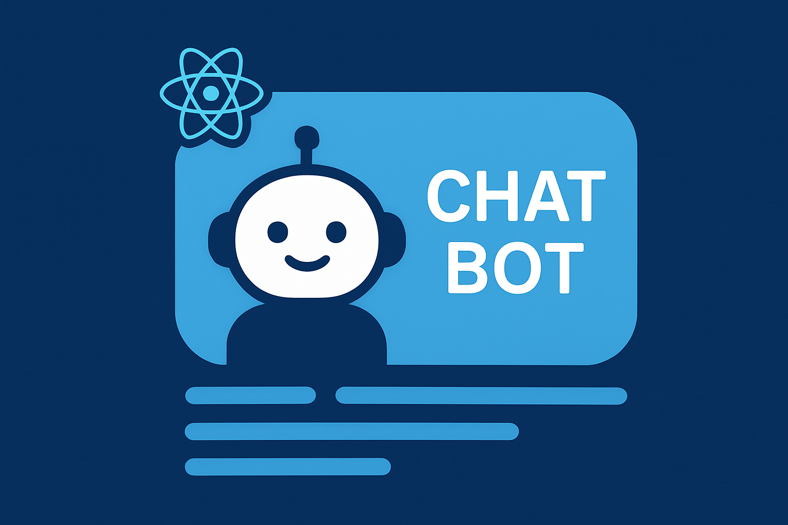

<h1 align="center"> AI priori </h1>

<p align="center">
  
  
  
  
</p>

<p align="center">
  
</p>

Small React + TypeScript chat UI that talks to a backend LLM endpoint.  
Uses Vite, React 19, TypeScript, lucide-react for icons.

## 🔗 Quick links

- App entry: [src/main.tsx](src/main.tsx)
- Main UI: [src/App.tsx](src/App.tsx)
- Chat hook: [src/hooks/useChat.ts](src/hooks/useChat.ts)
- API wrapper: [src/services/api.ts](src/services/api.ts)
- Chat window: [src/components/ChatWindow.tsx](src/components/ChatWindow.tsx)
- Message component: [src/components/Message.tsx](src/components/Message.tsx)
- Styles: [src/styles/index.css](src/styles/index.css)
- Types: [src/types/index.ts](src/types/index.ts)
- Config: [vite.config.js](vite.config.js), [tsconfig.json](tsconfig.json), [package.json](package.json)

## 💻 Environment

- API base URL is read from VITE_API_URL. Copy and edit:
  - See [.env.example](.env.example)
  - Create `.env` at project root with:
    VITE_API_URL=http://localhost:8000
- Vite reads .env on startup, so you need to restart dev server after changing.

#### Project structure notes

- src/components: presentational UI (ChatWindow, Message, ChatForm)
- src/hooks: business logic (useChat)
- src/services: network layer (handleSendUserMessage in [src/services/api.ts](src/services/api.ts))
- src/styles: global and component styles ([src/styles/index.css](src/styles/index.css))
- src/types: shared TypeScript types

#### Styling & icons

- Uses plain CSS currently.
- Icons via [lucide-react](https://www.npmjs.com/package/lucide-react). See [src/App.tsx](src/App.tsx) for example using the **Bot icon**.

#### TypeScript

- Project is set up with TypeScript (`tsconfig.json`). Add types for new components and keep strict mode benefits.

## 👷‍♂️ How to run

Prerequisites

- Node.js (16+ recommended)
- npm

```bash
# Clone repository and enter folder
git clone https://github.com/filipebteixeira98/chatbot.git
cd chatbot

# Install dependencies
npm install

# Run dev server
npm run dev

# Open http://localhost:5173 (Vite prints the exact URL)
```

## 📝 License

This project is under the MIT license.

<p align="center">
  Made with ♥ by me
</p>
